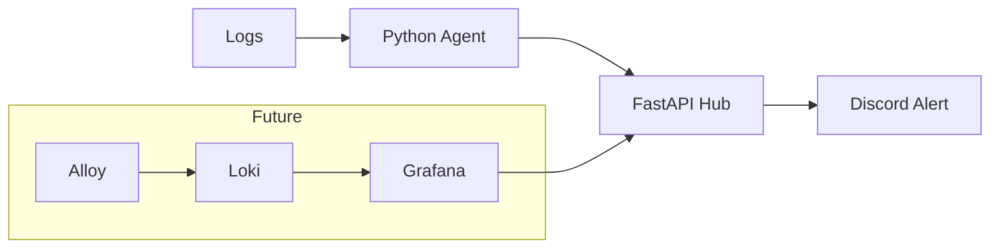

# 🚀 DevOps Alert System (Home Lab)

A simple event-driven alerting system built on a self-hosted home lab environment.
This project focuses on **log monitoring, event processing, and real-time alerting** using Python and FastAPI.

---

## 🧠 Overview

This system is designed to simulate a real-world DevOps workflow:

* Monitor application logs
* Detect important events
* Send alerts to Discord

---

## 🧱 Architecture



---

## ⚙️ Tech Stack

### 🔵 Core System

* Python
* FastAPI
* Requests

### 🟣 Monitoring & Alerting

* Custom Python Log Agent
* Discord Webhook

---

## 🔍 Features

* 📄 Real-time log monitoring (tail-like behavior)
* ⚡ Event-based alerting system
* 🔔 Discord integration for notifications
* 🧩 Modular design (easy to extend for multiple apps)

---

## 🚀 Getting Started

### 1. Clone the repository

```bash
git clone https://github.com/thor-thevapol/devops-alert-system.git
cd devops-alert-system
```

---

### 2. Run FastAPI Hub

```bash
cd fastapi-hub
pip install -r requirements.txt
uvicorn main:app --reload
```

---

### 3. Run Log Agent

```bash
cd agents
python log_agent.py
```

---

### 4. Send test event
Linux
```bash
curl -X POST http://localhost:8000/event \
-H "Content-Type: application/json" \
-d '{"app":"test","level":"info","message":"hello"}'
```
Windows
```bash
curl -X POST http://localhost:8000/event ^
-H "Content-Type: application/json" ^
-d "{\"app\":\"test\",\"level\":\"info\",\"message\":\"hello\"}"
```

---

## 🔐 Environment Variables

Create a `.env` file:

```env
DISCORD_WEBHOOK=your_webhook_here
```

> ⚠️ Do not commit real secrets to GitHub

---

## 🧠 System Design

This project separates responsibilities into:

* **Agent Layer** → reads logs and detects events
* **API Layer** → processes and formats events
* **Notification Layer** → sends alerts to external services

---

## 🎯 Use Case

This system simulates a real-world DevOps alerting workflow:

- Detect application-level events from logs
- Process events centrally
- Send real-time alerts to communication platforms

Useful for:
- Self-hosted environments
- Home lab monitoring
- Learning observability and alerting systems

---

## 🔮 Future Improvements

* 📊 Integrate logging system with Loki
* 📈 Add Grafana for visualization
* 🔁 Alert deduplication / rate limiting
* 🐳 Docker Compose setup for full system
* 📡 Multi-service monitoring (NGINX, apps, etc.)

---

## 🧩 Documentation

* Architecture diagrams (planned with Mermaid)
* Notes and system design (Obsidian)

---

## 💡 Motivation

This project is part of a personal journey to learn:

* DevOps practices
* Observability concepts
* Real-world system design

---

## ⚠️ Limitations

- No authentication on API endpoint
- No rate limiting
- No retry mechanism for failed alerts

---

## 📌 Note

Sensitive configurations (e.g., secrets, infrastructure details) are excluded from this repository.

---

## 👨‍💻 Author

Thor (Thevapol)

DevOps learner building real-world systems 🚀
=======
<<<<<<< HEAD
# 🚀 DevOps Alert System (Home Lab)

A simple event-driven alerting system built on a self-hosted home lab environment.
This project focuses on **log monitoring, event processing, and real-time alerting** using Python and FastAPI.

---

## 🧠 Overview

This system is designed to simulate a real-world DevOps workflow:

* Monitor application logs
* Detect important events
* Send alerts to Discord

---

## 🧱 Architecture

```text
logs
        ↓
Python Agent (log reader)
        ↓
FastAPI Hub (event processing)
        ↓
Discord (alert notification)
```

---

## ⚙️ Tech Stack

### 🔵 Core System

* Python
* FastAPI
* Requests

### 🟣 Monitoring & Alerting

* Custom Python Log Agent
* Discord Webhook

---

## 🔍 Features

* 📄 Real-time log monitoring (tail-like behavior)
* ⚡ Event-based alerting system
* 🔔 Discord integration for notifications
* 🧩 Modular design (easy to extend for multiple apps)

---

## 🚀 Getting Started

### 1. Clone the repository

```bash
git clone https://github.com/thor-thevapol/devops-alert-system.git
cd devops-alert-system
```

---

### 2. Run FastAPI Hub

```bash
cd fastapi-hub
pip install -r requirements.txt
uvicorn main:app --reload
```

---

### 3. Run Log Agent

```bash
cd agents
python log_agent.py
```

---

### 4. Send test event

```bash
curl -X POST http://localhost:8000/event \
-H "Content-Type: application/json" \
-d '{"app":"test","level":"info","message":"hello"}'
```

```Windows cmd
curl -X POST http://localhost:8000/event ^
-H "Content-Type: application/json" ^
-d "{\"app\":\"test\",\"level\":\"info\",\"message\":\"hello\"}"
```

---

## 🔐 Environment Variables

Create a `.env` file:

```env
DISCORD_WEBHOOK=your_webhook_here
```

> ⚠️ Do not commit real secrets to GitHub

---

## 🧠 System Design

This project separates responsibilities into:

* **Agent Layer** → reads logs and detects events
* **API Layer** → processes and formats events
* **Notification Layer** → sends alerts to external services

---

## 🔮 Future Improvements

* 📊 Integrate logging system with Loki
* 📈 Add Grafana for visualization
* 🔁 Alert deduplication / rate limiting
* 🐳 Docker Compose setup for full system
* 📡 Multi-service monitoring (NGINX, apps, etc.)

---

## 🧩 Documentation

* Architecture diagrams (planned with Mermaid)
* Notes and system design (Obsidian)

---

## 💡 Motivation

This project is part of a personal journey to learn:

* DevOps practices
* Observability concepts
* Real-world system design

---

## 📌 Note

Sensitive configurations (e.g., secrets, infrastructure details) are excluded from this repository.

---

## 👨‍💻 Author

Thor (Thevapol)
DevOps learner building real-world systems 🚀
=======
# devops-alert-system
